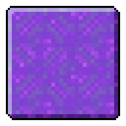

<h3 align="center">
   
  <h2 align="center">Portal GUI</h2>
  
Fabric mod to prevents portals from closing your GUI

</h3>

### About
Normally, if you have your inventory, chat, or any other GUIs open while moving into a Nether portal, the GUI will be closed. However, this mod removes that behavior allowing them to stay open.

### Building
- Clone the repository
- `./gradlew build` (Linux/macOS/BSD) or `gradlew.bat build` (Windows)
- Output will be in `build/libs/` named `PortalGUI-<version>.jar`
